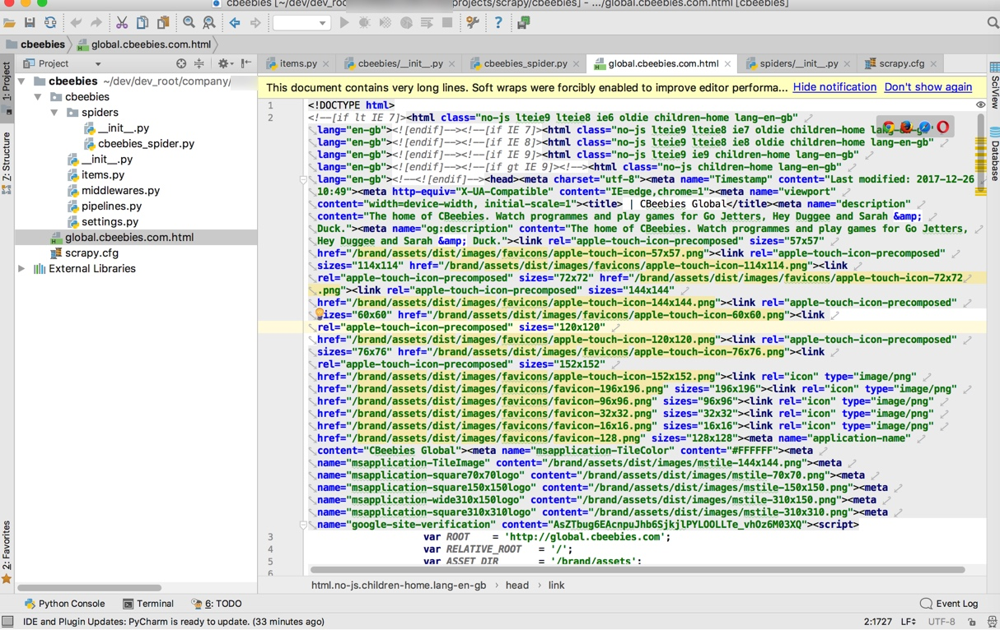
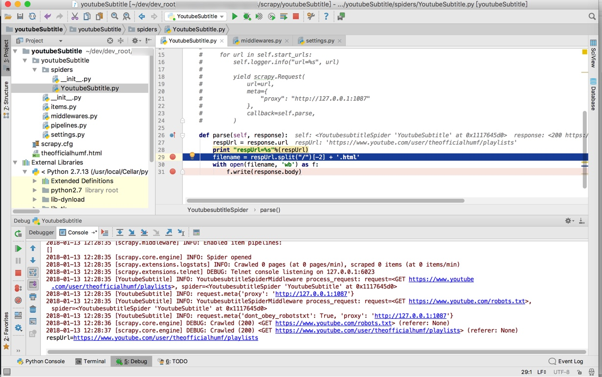
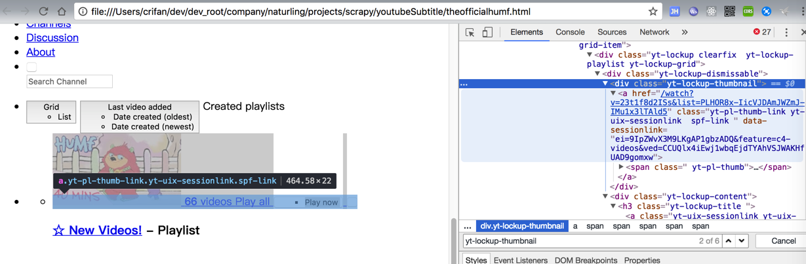
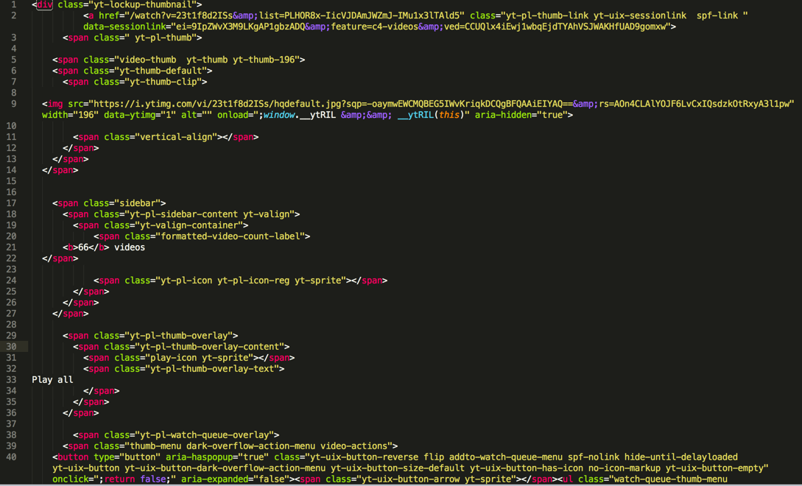
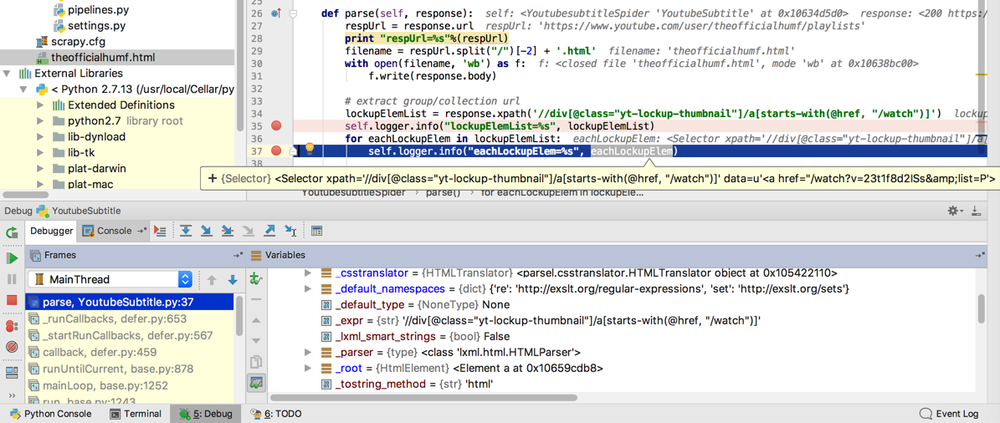
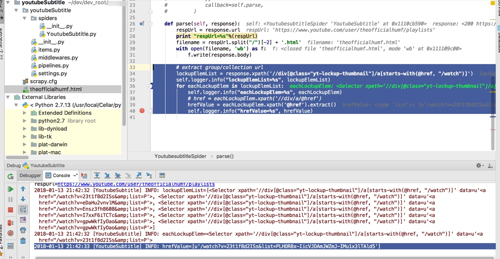
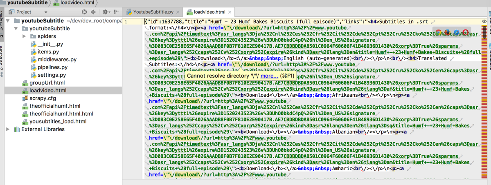
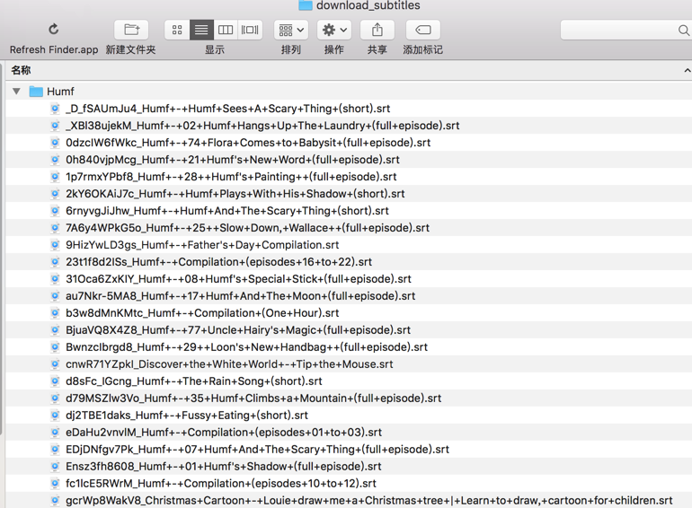

# 举例

## 举例：新建cbeebies爬虫

```bash
scrapy startproject cbeebies

cd cbeebies

scrapy crawl Cbeebies
```

即可生成对应的html文件：



## 举例：抓取Youtube中humf的字幕

### 需求

想要抓取：

[Humf – Official Channel – YouTube – YouTube](https://www.youtube.com/user/theofficialhumf/playlists)

其下的各个视频系列中的字幕文件。

其中获取YouTube字幕本身是依赖于：

http://www.yousubtitles.com

去实现的。

### 实现

```bash

scrapy startproject youtubeSubtitle

cd youtubeSubtitle

scrapy genspider YoutubeSubtitle youtube.com
```

生成文件内容：

```python
# -*- coding: utf-8 -*-
import scrapy
class YoutubesubtitleSpider(scrapy.Spider):
    name = "YoutubeSubtitle"
    allowed_domains = ["youtube.com"]
    start_urls = ["http://youtube.com/"]
    def parse(self, response):
        pass
```

继续优化和添加内容：

```python
# -*- coding: utf-8 -*-
import scrapy
class YoutubesubtitleSpider(scrapy.Spider):
    name = "YoutubeSubtitle"
    allowed_domains = ["youtube.com", "yousubtitles.com"]
    start_urls = [
        "https://www.youtube.com/user/theofficialhumf/playlists"
    ]

    def parse(self, response):
        respUrl = response.url
        print "respUrl=%s"%(respUrl)
        filename = respUrl.split("/")[-2] + ".html"
        with open(filename, "wb") as f:
            f.write(response.body)
```

去运行，结果无法访问YouTube，所以要去加上代理：

`/xxx/scrapy/youtubeSubtitle/youtubeSubtitle/settings.py`

中设置：

```python
DOWNLOADER_MIDDLEWARES = {
    # 'scrapy.downloadermiddlewares.httpproxy.HttpProxyMiddleware': 1,
    # 'scrapy.downloadermiddlewares.httpproxy.HttpProxyMiddleware': None,
    "youtubeSubtitle.middlewares.ProxyMiddleware" : 1
}
```

`/xxx/scrapy/youtubeSubtitle/youtubeSubtitle/middlewares.py`
```python
# Start your middleware class
class ProxyMiddleware(object):
    def process_request(self, request, spider):
        spider.logger.info("YoutubesubtitleSpiderMiddleware process_request: request=%s, spider=%s", request, spider)
        request.meta['proxy'] = "http://127.0.0.1:1087"
        spider.logger.info("request.meta%s", request.meta)
```

其中`http://127.0.0.1:1087`是本地的[ss](https://book.crifan.com/books/scientific_network_summary/website/)的代理。

即可通过代理访问到YouTube内容了：



此处希望提取的是：



中的：

`'//div[@class="yt-lockup-thumbnail"]/a[starts-with(@href, "/watch")]'`

经过尝试，是通过：

```bash
scrapy shell

fetch("https://www.youtube.com/user/theofficialhumf/playlists")

view(response)

response.body

response.xpath('//div[@class="yt-lockup-thumbnail"]/a[starts-with(@href, "/watch")]')[0].extract()
```

输出了我们希望的html，拷贝出来效果是：



继续调试，写代码：

```python
def parse(self, response):
    respUrl = response.url
    print "respUrl=%s"%(respUrl)
    filename = respUrl.split("/")[-2] + '.html'
    with open(filename, 'wb') as f:
        f.write(response.body)

    # extract group/collection url
    lockupElemList = response.xpath('//div[@class="yt-lockup-thumbnail"]/a[starts-with(@href, "/watch")]')
    self.logger.info("lockupElemList=%s", lockupElemList)
    for eachLockupElem in lockupElemList:
        self.logger.info("eachLockupElem=%s", eachLockupElem)
```

是可以获得对应的`div`的`element`的：



接着去用获取其中a的href的值，方式是：

在Scrapy shell中调试的效果：

```bash
>>> response.xpath('//div[@class="yt-lockup-thumbnail"]/a[starts-with(@href, "/watch")]/@href')[0]

<Selector xpath='//div[@class="yt-lockup-thumbnail"]/a[starts-with(@href, "/watch")]/@href' data=u'/watch?v=23t1f8d2ISs&list=PLHOR8x-IicVJD'>

>>> response.xpath('//div[@class="yt-lockup-thumbnail"]/a[starts-with(@href, "/watch")]/@href')[0].extract()

u'/watch?v=23t1f8d2ISs&list=PLHOR8x-IicVJDAmJWZmJ-IMu1x3lTAld5'
```

代码：

```python
# extract group/collection url
lockupElemList = response.xpath('//div[@class="yt-lockup-thumbnail"]/a[starts-with(@href, "/watch")]')
self.logger.info("lockupElemList=%s", lockupElemList)

for eachLockupElem in lockupElemList:
    self.logger.info("eachLockupElem=%s", eachLockupElem)
    # href = eachLockupElem.xpath('//div/a/@href')
    hrefValue = eachLockupElem.xpath('@href').extract()
    self.logger.info("hrefValue=%s", hrefValue)
```

得到输出：

```bash
2018-01-13 21:42:33 [YoutubeSubtitle] INFO: hrefValue=[u'/watch?v=23t1f8d2ISs&list=PLHOR8x-IicVJDAmJWZmJ-IMu1x3lTAld5']
```



继续调试，为了获取网页的全部内容，经过[研究](https://www.crifan.com/scrapy_how_to_load_all_page_content/)，逻辑是：

```
Request URL: http://www.yousubtitles.com/loadvideo/23t1f8d2ISs
Request Method: POST
```

所以写成代码：

```python
import re

            foundVideoId = re.search(r'v=(?P&lt;videoId&gt;[\w\-]+)', singleVideoUrl)
            if foundVideoId:
                videoId = foundVideoId.group("videoId")
                self.logger.info("videoId=%s", videoId) # u'23t1f8d2ISs'

                # http://www.yousubtitles.com/loadvideo/23t1f8d2ISs
                loadVideoUrl = "http://www.yousubtitles.com/loadvideo/" + videoId
                self.logger.info("loadVideoUrl=%s", loadVideoUrl) # u'http://www.yousubtitles.com/loadvideo/23t1f8d2ISs'
                yield scrapy.Request(url=loadVideoUrl, callback=self.parseLoadVideoResp, method="POST")

def parseLoadVideoResp(self, response):
    """
    parse response of yousubtitles load video for each youtube video id
    :param response:
    :return:
    """
    # for debug
    self.saveHtml("loadvideo", response.body)
    respUrl = response.url
    self.logger.info("respUrl=%s", respUrl)
```

效果：



接着去解析html源码，经过考虑决定用之前就用过的[BeautifulSoup](https://www.crifan.com/python_third_party_lib_html_parser_beautifulsoup/)

先去安装：

```bash
pip install beautifulsoup4
```

然后写解析代码：

```python
decodedLinksDict = json.loads(response.body)
self.logger.info("decodedLinksDict=%s", decodedLinksDict)
linksHtml = decodedLinksDict["links"]
# self.logger.info("linksHtml=%s", linksHtml)
linksSoup = BeautifulSoup(linksHtml)
englishNode = linksSoup.find(lambda tag : tag.name == "p" and "English" in tag.get_text())
if englishNode:
    # self.logger.info("englishNode.contents=%s", englishNode.contents)
    self.logger.info("englishNode.text=%s", englishNode.text)
    # self.logger.info("englishNode=%s", englishNode)
    downloadHref = englishNode.a["href"]
    self.logger.info("downloadHref=%s", downloadHref) # /download/?url=….&amp;title=Humf+-+Compilation+%28episodes+16+to+22%29
    downloadUrl = "http://www.yousubtitles.com" + downloadHref # http://www.yousubtitles.com/download/?url=http%3A%2F%2F...n&amp;title=Humf+-+Compilation+%28episodes+16+to+22%29
    self.logger.info("downloadUrl=%s", downloadUrl)
```

至此，完整代码是：

```python
# -*- coding: utf-8 -*-
import scrapy
# from scrapy import Request, Spider
from urllib import urlencode, unquote
import re
import json
from bs4 import BeautifulSoup
import os

class YoutubesubtitleSpider(scrapy.Spider):
    name = 'YoutubeSubtitle'
    allowed_domains = ['youtube.com', "yousubtitles.com"]
    start_urls = [
        "https://www.youtube.com/user/theofficialhumf/playlists"
    ]

    # def start_requests(self):
    #     """This is our first request to grab all the urls of the profiles.
    #     """
    #     for url in self.start_urls:
    #         self.logger.info("url=%s", url)
    #
    #         yield scrapy.Request(
    #             url=url,
    #             meta={
    #                 "proxy": "http://127.0.0.1:1087"
    #             },
    #             callback=self.parse,
    #         )

    def saveToFile(self, filename, content, suffix=".html"):
        filename = filename + suffix
        with open(filename, 'wb') as f:
            f.write(content)

    def parse(self, response):
        respUrl = response.url
        print "respUrl=%s"%(respUrl)
        filename = respUrl.split("/")[-2] + '.html'
        self.saveToFile(filename=filename, content=response.body)
        # with open(filename, 'wb') as f:
        #     f.write(response.body)

        # extract group/collection url
        lockupElemList = response.xpath('//div[@class="yt-lockup-thumbnail"]/a[starts-with(@href, "/watch")]')
        self.logger.info("lockupElemList=%s", lockupElemList)
        for eachLockupElem in lockupElemList:
            self.logger.info("eachLockupElem=%s", eachLockupElem)
            # href = eachLockupElem.xpath('//div/a/@href')
            hrefValue = eachLockupElem.xpath('@href').extract()
            self.logger.info("hrefValue=%s", hrefValue)
            groupUrl = u"https://www.youtube.com" + hrefValue[0]
            self.logger.info("groupUrl=%s", groupUrl)

            yield scrapy.Request(url=groupUrl, callback=self.parseEachYoutubeUrl)

    def parseEachYoutubeUrl(self, response):
        """
        parse each youtube url from group url's response
        :param response:
        :return:
        """
        # for debug
        respUrl = response.url
        self.logger.info("respUrl=%s", respUrl)
        self.saveToFile("groupUrl", response.body)

        dataIdElemList = response.xpath('//li[@data-video-id]/a[@href]')
        self.logger.info("dataIdElemList=%s", dataIdElemList)
        if dataIdElemList:
            dataIdElemListCount = len(dataIdElemList)
            self.logger.info("dataIdElemListCount=%s", dataIdElemListCount)

            for eachDataIdElem in dataIdElemList:
                self.logger.info("eachDataIdElem=%s", eachDataIdElem)
                hrefValue = eachDataIdElem.xpath('@href').extract()
                self.logger.info("hrefValue=%s", hrefValue)
                singleVideoUrl = u"https://www.youtube.com" + hrefValue[0]
                self.logger.info("singleVideoUrl=%s", singleVideoUrl)
                # https://www.youtube.com/watch?v=23t1f8d2ISs&amp;list=PLHOR8x-IicVJDAmJWZmJ-IMu1x3lTAld5&amp;index=1

                # # http://www.yousubtitles.com/load/?url=https%3A%2F%2Fwww.youtube.com%2Fwatch%3Fv%3DgtaC1JVjvO4%26index%3D58%26list%3DPLHOR8x-IicVJDAmJWZmJ-IMu1x3lTAld5&amp;ch=1
                # yousubtitlesUrlBase = "http://www.yousubtitles.com/load/?"
                # youtubeUrlParaDict = {"url" : singleVideoUrl}
                # encodedUrlPara = urlencode(youtubeUrlParaDict)
                # fullYousubtitlesUrl = yousubtitlesUrlBase + encodedUrlPara
                #
                # yield scrapy.Request(url=fullYousubtitlesUrl, callback=self.parseYoususbtitlesUrl)

                foundVideoId = re.search(r'v=(?P&lt;videoId&gt;[\w\-]+)', singleVideoUrl)
                if foundVideoId:
                    videoId = foundVideoId.group("videoId")
                    self.logger.info("videoId=%s", videoId) # u'23t1f8d2ISs'

                    # http://www.yousubtitles.com/loadvideo/23t1f8d2ISs
                    loadVideoUrl = "http://www.yousubtitles.com/loadvideo/" + videoId
                    self.logger.info("loadVideoUrl=%s", loadVideoUrl) # u'http://www.yousubtitles.com/loadvideo/23t1f8d2ISs'
                    yield scrapy.Request(url=loadVideoUrl, callback=self.parseLoadVideoResp, method="POST")

    def parseLoadVideoResp(self, response):
        """
        parse response of yousubtitles load video for each youtube video id
        :param response:
        :return:
        """
        # for debug
        self.saveToFile("loadvideo", response.body)
        respUrl = response.url # 'http://www.yousubtitles.com/loadvideo/UhO0bkdC4pQ'
        self.logger.info("respUrl=%s", respUrl)

        decodedLinksDict = json.loads(response.body)
        self.logger.info("decodedLinksDict=%s", decodedLinksDict)
        if "links" not in decodedLinksDict:
            self.logger.warning("links not in decodedLinksDict=%s", decodedLinksDict)
            # {u'error': 1}
        else:
            linksHtml = decodedLinksDict["links"]
            # self.logger.info("linksHtml=%s", linksHtml)
            linksSoup = BeautifulSoup(linksHtml)
            self.logger.info("linksSoup=%s", linksSoup)
            englishNode = linksSoup.find(lambda tag : tag.name == "p" and "English" in tag.get_text())
            if englishNode:
                # self.logger.info("englishNode.contents=%s", englishNode.contents)
                self.logger.info("englishNode.text=%s", englishNode.text)
                # self.logger.info("englishNode=%s", englishNode)
                downloadHref = englishNode.a["href"]
                self.logger.info("downloadHref=%s", downloadHref) # /download/?url=http%3A%2F%2Fwww.youtube.com%2Fapi%2Ftimedtext%3Fsignature%3D0300D3B6307468779D9FE34128AAC8FA4EE978E4.7D5E553538919EB4479D2AD710C693BABDED961D%26sparams%3Dasr_langs%252Ccaps%252Cv%252Cxorp%252Cexpire%26asr_langs%3Des%252Cru%252Cit%252Cnl%252Cpt%252Cde%252Cko%252Cja%252Cen%252Cfr%26caps%3Dasr%26hl%3Den_US%26xorp%3DTrue%26key%3Dyttt1%26expire%3D1520333270%26v%3D23t1f8d2ISs%26kind%3Dasr%26lang%3Den&amp;title=Humf+-+Compilation+%28episodes+16+to+22%29
                downloadUrl = "http://www.yousubtitles.com" + downloadHref # http://www.yousubtitles.com/download/?url=http%3A%2F%2Fwww.youtube.com%2Fapi%2Ftimedtext%3Fsignature%3D0300D3B6307468779D9FE34128AAC8FA4EE978E4.7D5E553538919EB4479D2AD710C693BABDED961D%26sparams%3Dasr_langs%252Ccaps%252Cv%252Cxorp%252Cexpire%26asr_langs%3Des%252Cru%252Cit%252Cnl%252Cpt%252Cde%252Cko%252Cja%252Cen%252Cfr%26caps%3Dasr%26hl%3Den_US%26xorp%3DTrue%26key%3Dyttt1%26expire%3D1520333270%26v%3D23t1f8d2ISs%26kind%3Dasr%26lang%3Den&amp;title=Humf+-+Compilation+%28episodes+16+to+22%29
                self.logger.info("downloadUrl=%s", downloadUrl)

                yield scrapy.Request(url=downloadUrl, callback=self.parseDownloadSubtitlesResp)
            else:
                self.logger.warning("can not find english subtile node")

    def parseDownloadSubtitlesResp(self, response):
        """
        parse download subtitles of youtube video
        :param response:
        :return:
        """
        # for debug
        respUrl = response.url # http://www.yousubtitles.com/download/?url=http%3A%2F%2Fwww.youtube.com%2Fapi%2Ftimedtext%3Fsignature%3D4A2A6F9EA37E8A508D6D3C93B575ADFFAA910E66.40BD74A9A28E3B158532EE17837676F7B11B1180%26xorp%3DTrue%26sparams%3Dasr_langs%252Ccaps%252Cv%252Cxorp%252Cexpire%26asr_langs%3Dde%252Cru%252Cko%252Cja%252Cen%252Cpt%252Cit%252Ces%252Cnl%252Cfr%26hl%3Den_US%26key%3Dyttt1%26caps%3Dasr%26expire%3D1520333397%26v%3D23t1f8d2ISs%26kind%3Dasr%26lang%3Den&amp;title=Humf+-+Compilation+%28episodes+16+to+22%29
        self.logger.info("respUrl=%s", respUrl)
        decodedUrl = unquote(respUrl) # http://www.yousubtitles.com/download/?url=http://www.youtube.com/api/timedtext?caps=asr&amp;v=7A6y4WPkG5o&amp;expire=1520334242&amp;asr_langs=en%2Cfr%2Cja%2Cko%2Cde%2Cpt%2Cit%2Cnl%2Cru%2Ces&amp;hl=en_US&amp;xorp=True&amp;key=yttt1&amp;signature=26E544FE885C617E1B6AC946C1EE21C1E0C95795.83020B2CBAF8806252387C5AD7BA0879B2CC1888&amp;sparams=asr_langs%2Ccaps%2Cv%2Cxorp%2Cexpire&amp;kind=asr&amp;lang=en&amp;title=Humf+-+25++Slow+Down,+Wallace++(full+episode)
        self.logger.info("decodedUrl=%s", decodedUrl)
        foundIdName = re.search(r'[&amp;|?]v=(?P&lt;videoId&gt;[\w\-]+).*&amp;title=(?P&lt;videoTitle&gt;[^&amp;]+)', decodedUrl)
        if foundIdName:
            videoId = foundIdName.group("videoId") # '7A6y4WPkG5o'
            videoTitle = foundIdName.group("videoTitle") # Humf+-+25++Slow+Down,+Wallace++(full+episode)
            subtitleFilename = videoId + "_" + videoTitle

            downloadFolder = "download_subtitles/Humf"
            if not os.path.exists(downloadFolder):
                os.makedirs(downloadFolder)

            self.saveToFile(downloadFolder + "/" + subtitleFilename, response.body, suffix=".srt")
        else:
            self.logger.warning("can not find id and name")

    # def parseYoususbtitlesUrl(self, response):
    #     """
    #     parse each yousubtitles.com download response
    #     :param response:
    #     :return:
    #     """
    #     # for debug
    #     self.saveToFile("yousubtitles_load", response.body)
    #     respUrl = response.url
    #     self.logger.info("respUrl=%s", respUrl)
```

即可下载到对应字幕文件了：



##### 后续

其他一些额外优化和需求的实现：

向后传递参数的，可以借用meta

```python
yield scrapy.Request(url=loadVideoUrl, callback=self.parseLoadVideoResp, method="POST", meta={"humfGroupTitle" : humfGroupTitle})
```

之后的callback中即可通过response.meta去取值：

```python
def parseLoadVideoResp(self, response):
    humfGroupTitle = response.meta["humfGroupTitle"]
```

