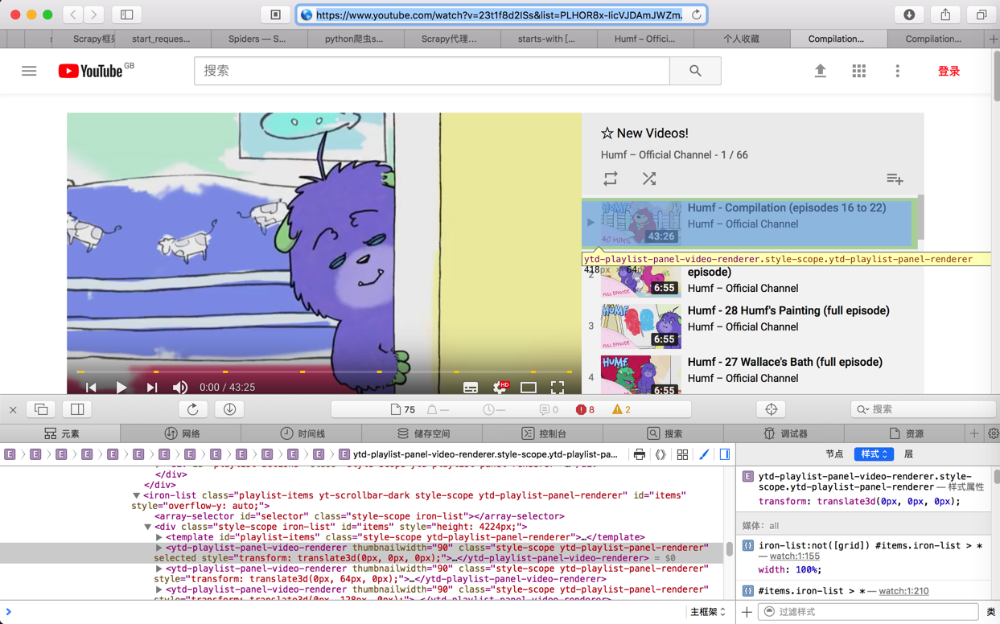
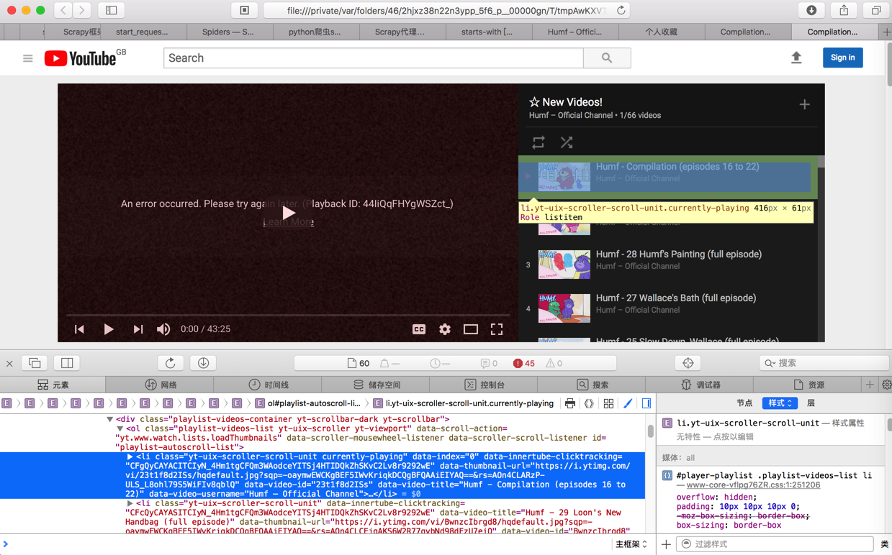
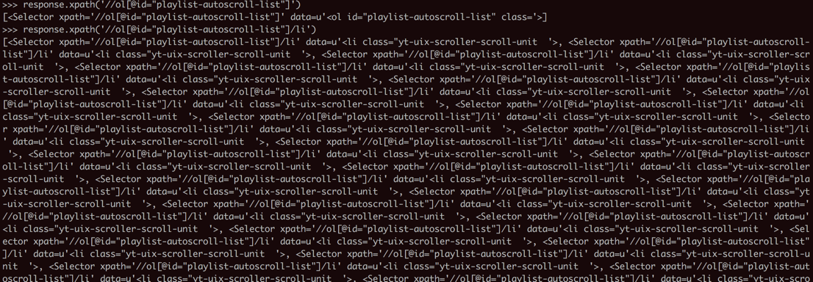

# 看到和抓到的源码不同

同一个url，浏览器直接打开和用scrapy去打开，html内容不一样，所以查找元素的`xpath`写法也不同

举例：

https://www.youtube.com/watch?v=23t1f8d2ISs&list=PLHOR8x-IicVJDAmJWZmJ-IMu1x3lTAld5

用`Safari`浏览器打开的效果是：



对应要找到元素的`xpath`写法是：

```css
//*[@id="items"]/ytd-playlist-panel-video-renderer[1]
```

但是用`Scrapy`的`shell`中用`view(response)`保存后打开的本地html：

`file:///private/var/folders/46/2hjxz38n22n3ypp_5f6_p__00000gn/T/tmpAwKXVT.html`

的预览效果是：



对应`xpath`是：

```css
//*[@id="playlist-autoscroll-list"]/li[1]
```

即，网页中看到内容，和Scarpy抓到的内容，不一样，对应要找的元素的xpath也就不一样了.

最后用：

```python
>>> response.xpath('//ol[@id="playlist-autoscroll-list"]')
[<Selector xpath='//ol[@id="playlist-autoscroll-list"]' data=u'<ol id="playlist-autoscroll-list" class='>]
>>> response.xpath('//ol[@id="playlist-autoscroll-list"]/li')
```

才能找到要的元素：



**心得**：

用`scrapy`的`shell`的`view(response)`去打开浏览器，然后再去看html的xpath -》这样往往可以省去很多的调试时间

否则就会出现之前的问题：

在用浏览器打开的页面中，调试了半天，找到想要的url的内容，结果实际上scrapy得到的html已经不一样，无法用之前写法得到想要的内容。
