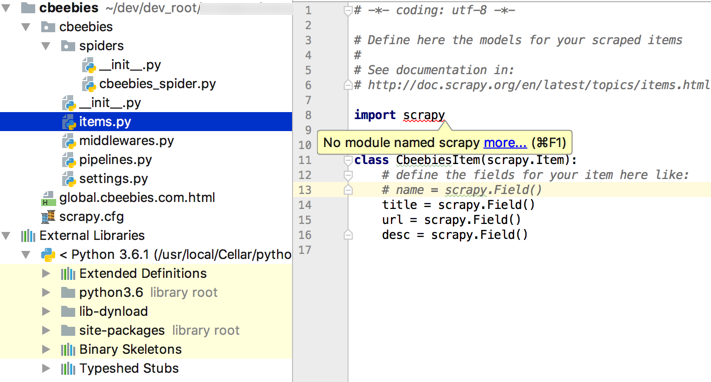
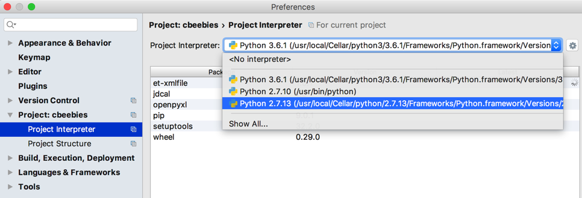
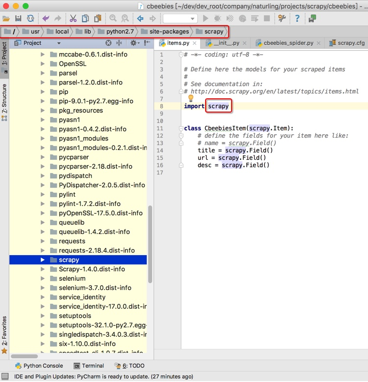
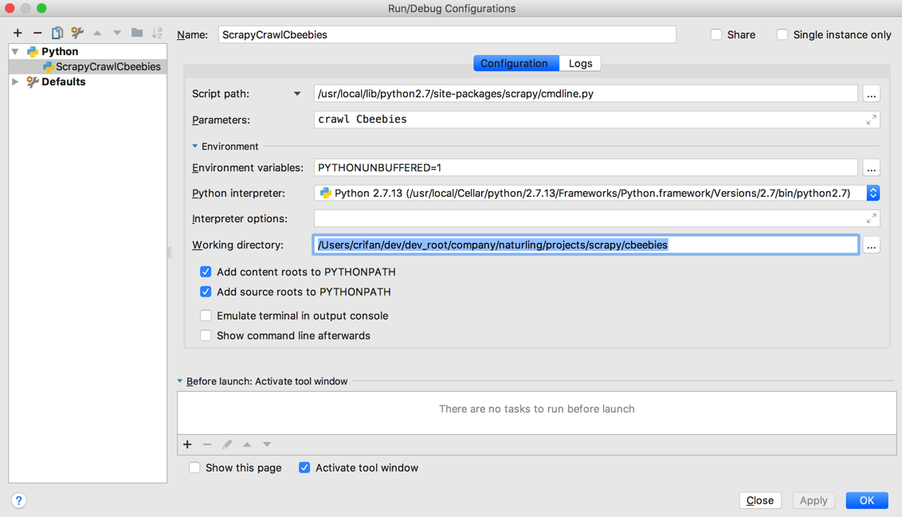
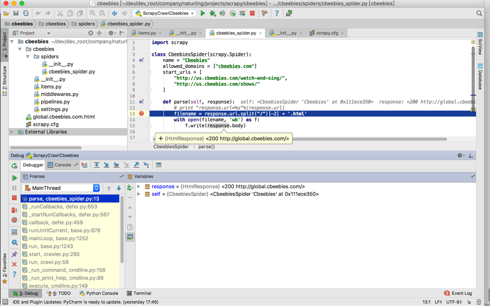

# PyCharm调试Scrapy

此处整理用PyCharm调试Scrapy的一些心得。

## No module named scrapy

* **问题**：已安装Scrapy，但是PyCharm中找不到而报错`No module named scrapy`

* **原因**：Python版本=Python解释器 设置不正确
* **解决办法**：设置正确的当前所使用的Python版本

`设置`->`Project：xxx` -> `Project Interpreter`-> 换成你希望使用的Python版本

即可正常导入scrapy，以及看到对应源码：

## 如何用PyCharm调试Scrapy

* **原理**：
  * **背景**：scrapy中有个`cmdline.py`是用于命令行运行Scrapy的。
    * 而PyCharm调试Scrapy，其实就是基于命令行方式去启动Scrapy
      * 所以就是去启动`cmdline.py`并去加上合适参数即可
* **步骤**：新建`Python`的`Debug Configurations`，加上参数：

* `Script path`: `/{PYTHON_ROOT}/site-packages/scrapy/cmdline.py`
  * 举例：`/usr/local/lib/python2.7/site-packages/scrapy/cmdline.py`
* `Parameter`：你要调试的Scrapy项目
  * 举例：`crawl Cbeebies`
* `Working directory`：你的Scrapy爬虫所在根目录
  * 举例：`/User/crifan/dev/dev_root/xxx/projects/scrapy/cbeebies`

然后启动调试，即可实时调试了：

