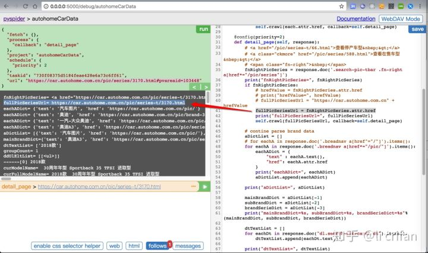
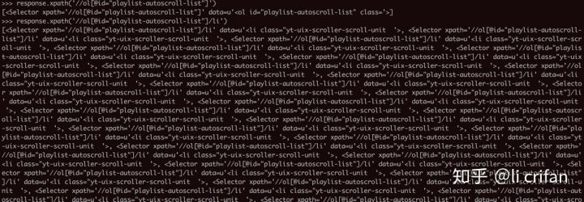

# Scrapy vs PySpider

关于Scrapy和PySpider的对比，把之前[别处](https://www.crifan.com/python_spider_framework_pyspider_vs_scrapy/)的回复，整理过来供参考

* 对比
  * PySpider：简单易上手，带图形界面（基于浏览器页面）
      * 一图胜千言：在WebUI中调试爬虫代码
        * 
  * Scrapy：可以高级定制化实现更加复杂的控制
    * 但是没有一个直观的方便的调试界面
      * 一图胜千言：Scrapy一般是在命令行界面中调试页面返回数据
        * 
* 建议
  * 对于**普通的爬虫**，去爬你要的数据，PySpider已经足够你用了
    * 举例：
      * [【已解决】写Python爬虫爬取汽车之家品牌车系车型数据 – 在路上](https://www.crifan.com/use_pyspider_to_crawl_autohome_car_brand_serial_model_data/)
  * 除非有其他**高级的特殊需求**，再考虑用Scrapy
    * 举例：
      * [用Scrapy去爬取Youtube中Humf的字幕](http://book.crifan.com/books/python_spider_scrapy/website/basic_usage/scrapy_examples.html)
